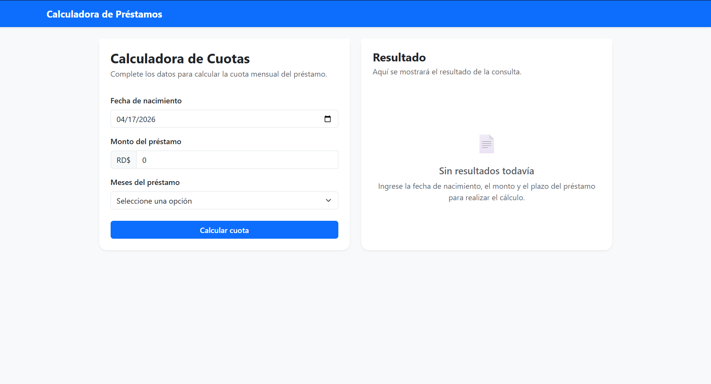

# Calculadora de Cuotas - Prueba Técnica

Aplicación desarrollada en ASP.NET Core que calcula la cuota mensual de un préstamo según la edad, el monto y el plazo.

---

## 📸 Vista de la aplicación

---

## 🚀 Tecnologías utilizadas

- ASP.NET Core MVC
- ASP.NET Core Web API
- SQL Server
- Dapper
- Bootstrap
- Stored Procedures

---

## 🧠 Arquitectura

El proyecto está dividido en capas:

- Prestamos.Web → Interfaz (MVC)
- Prestamos.Api → API REST
- Prestamos.Business → Lógica de negocio
- Prestamos.Data → Acceso a datos
- Prestamos.Entities → Modelos y DTOs

---

## ⚙️ Funcionalidad

Permite ingresar:

- Fecha de nacimiento
- Monto del préstamo
- Meses (3, 6, 9, 12)

Y calcula:

Cuota = (Monto * Tasa) / Meses

También:
- valida edad (18–25)
- registra cada consulta en la base de datos

---

## 🗄️ Base de datos

Ejecutar el archivo:

database.sql

Esto crea:
- Tablas
- Datos iniciales
- Stored Procedures

---

## ▶️ Ejecución

1. Clonar el repositorio:

git clone https://github.com/TU_USUARIO/PrestamosSolution.git

2. Abrir la solución en Visual Studio

3. Ejecutar database.sql en SQL Server

4. Configurar cadena de conexión en:

Prestamos.Api/appsettings.json

5. Ejecutar:
- Prestamos.Api
- Prestamos.Web

---

## 👨‍💻 Autor

Adrian Curet
